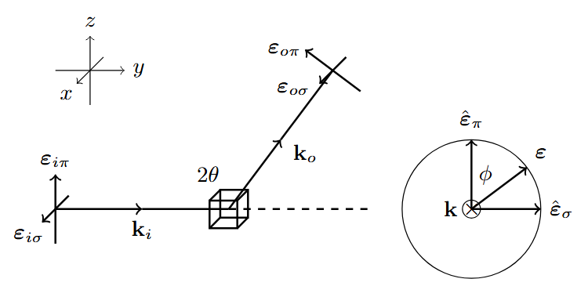

# Polarixs

**Polarixs** is a Python package for angular and polarization dependent RIXS convolution. It also provides functions to read necessary data from RASSI calculations performed by OpenMolcas.  

The functions available in this package are introduced below, and example usage can be found in `Examples.ipynb`. Although Polarixs is designed to work with OpenMolcas output, it is not limited to it. Other data can be organized into Python lists and processed using the same functions.   

## Functions and Data Structure

### 1 Reading OpenMolcas Data

The package contains three functions to read the transition data from `.out` file. These functions requre seperately the keyword of `DIPRint/QIPRint` (default in OpenMolcas), `TRDI/TRDC`, `MEES/MESO`. 

```
Molcas_read_int(filename, SOC=False, Quadrupole=False, Velocity=False, Subset=0, GStates = [])
Molcas_read_vec(filename, SOC=False, Subset=0, GStates = [])
Molcas_read_ten(filename, SOC=False, Mltpl=2, Subset=0, GStates=[], Threshold=0)
```

The output of these functions is a list with each line has the following structure:

```
[Delta E, I, |g> index, |f> index] # From Molcas_read_int
[Delta E, x, y, z, |g> index, |f> index] # From Molcas_read_vec or _ten
[Delta E, xx, xy, xz, yy, yz, zz, |g> index, |f> index] # From Molcas_read_ten
```

This transition list is the data for the following convolution.

**Paramaters:**

* `SOC`: Bool.  
  - `True`: read spin–orbit coupling (SOC) state transitions.  
  - `False`: read spin-free state transitions.  

* `Quadrupole`: Bool.  
  - `True`: read quadrupole transitions.  
  - `False`: read dipole transitions.  

* `Velocity`: Bool.  
  - `True`: read velocity operator intensities.  
  - `False`: read multipole operator intensities.  

* `Subset`: Integer.  
  Used to separate ground and excited states. In RIXS calculations, the process is usually divided into two steps: transitions from the ground state \(g\) to intermediate states \(n\), and transitions from final states \(f\) to \(n\). This keyword helps obtain the correct \(n\) state index by minus this value, since all states in OpenMolcas are listed together by energy. It is also recommended to use `SUBSets` in RASSI calculations.  

* `GStates`: List of integers.  
  Only transitions from the states included in this list will be output.  

* `Mltpl`: Integer.  
  - `1`: read dipole transition matrix.  
  - `2`: read quadrupole transition matrix.  
  Note: the `PROPerities` keyword is required in RASSI calculations.  

* `Threshold`: Float.  
  Minimum multipole norm threshold for output.

### 2 Convolution Functions

#### 2.1 Direct Convolution

Direct Convolution operates on data containing only intensity. 

```
[Delta E, I, |g> index, |f> index]
```

The spectrum is computed using Lorentzian convolution. 

$$ I_{XAS} = \sum_{f} I_{gf} 
\frac{\Gamma/\pi}{(E_f - E_g - \hbar\omega)^2 +\Gamma^2} $$

$$ I_{RIXS} = \sum_{f} \sum_{n} \frac{I_{gn}I_{nf}}{(E_n - E_g - \hbar\omega_{i})^2 +\Gamma_n^2} 
\frac{\Gamma_f/\pi}{(E_f - E_g - \hbar(\omega_{i}-\omega_{o}))^2 +\Gamma_f^2} $$

This package provides functions for performing convolutions on both XAS and RIXS data. The outputs are a 1D array for XAS and a 2D array for RIXS.

```
xas_conv(w_inc, T, Gamma=2)
rixs_conv(w_inc, w_los, Tgn, Tnf, Gamma_n=2, Gamma_f=2)
```

#### 2.2 Powder Average

Both E1E1 and E2E1 processes are supported:

```
pw_dd_conv(
    w_inc, w_los, Tgn, Tnf, 
    Gamma_n=2, Gamma_f=2, 
    AngDep=True, theta=45, phii=0, phio=None, 
    filterin=np.diag([1, 1, 1]), filterout=np.diag([1, 1, 1])
)

pw_qd_conv(
    w_inc, w_los, Tgn, Tnf, 
    Gamma_n=2, Gamma_f=2, 
    AngDep=True, theta=45, phii=0, phio=None, 
    filterinl=np.diag([1, 1, 1]), filterinr=np.diag([1, 1, 1]), 
    filterout=np.diag([1, 1, 1])
)
```

**Paramaters:**

* `AngDep`: Bool.  
  - `True`: Considers angular and polarization dependence.  
  - `False`: Ignores angular and polarization dependence. In this case, the intensity is taken as the averaged Frobenius norm of the transition tensor (proportional to `rixs_conv`).
  
* `theta`, `phii`, and `phio`: Float.  
  The angular relationship is illustrated in the figure below. Note that the default value of `phio` is `None`. If not specified, the intensity is calculated assuming a detector without polarization distinction.  



* `filteri/il/ir/o`: $3\times3$ array.  
  These matrices are used to select elements of the transition tensors.
  - For E1E1: `Ti = filteri @ Ti`, `To = filteri @ To`. 
  - For E2E1: `Ti = filteril @ Ti @ filterir`, `To = filteri @ To`.
  

#### 2.3 Oriented Crystal

For crystals, the same functions as for powders are provided, with similar parameters.
In addition, an orientation matrix `R` must be defined. This is an Euler rotation matrix, following the coordinate convention shown in the figure above.

```
sc_dd_conv(
    w_inc, w_los, Tgn, Tnf, R, 
    Gamma_n=2, Gamma_f=2, 
    theta=45, phii=0, phio=0, 
    filterin=np.diag([1, 1, 1]), filterout=np.diag([1, 1, 1])
)

sc_qd_conv(
    w_inc, w_los, Tgn, Tnf, R, 
    Gamma_n=2, Gamma_f=2, 
    theta=45, phii=0, phio=0, 
    filterinl=np.diag([1, 1, 1]), filterinr=np.diag([1, 1, 1]), 
    filterout=np.diag([1, 1, 1])
)
```

## Citation
If you use Polarixs in your research, please cite it appropriately. 
