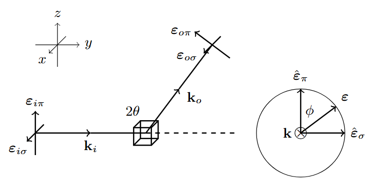

# Polarixs

**Polarixs** is a Python package for angular and polarization dependent RIXS convolution. It also provides functions to read necessary data from RASSI calculations performed by OpenMolcas.  

The functions available in this package are introduced below, and example usage can be found in `Examples.ipynb`. Although Polarixs is designed to work with OpenMolcas output, it is not limited to it. Other data can be organized into Python dictionary and processed using the same functions. 

This project is planned as a long-term maintained Python codebase. Convolution for crystal, magnetic related transition and elastic scattering will be developed.

## 1. Theoretical Fundamentals

(To be updated. Please refer to the citations)

## 2. Data Structure and Functions

### 2.1 Reading OpenMolcas Data

The package supports to read the transition data from both `.out` and `.h5` files produced by OpenMolcas. 

#### 2.1.1 Read `.out`

`molcas_out` contains three functions to read the transition data from `.out` file. These functions requre seperately the keyword of `DIPRint/QIPRint` (default in OpenMolcas), `TRDI/TRDC`, `MEES/MESO`. 

```
molcas_out.intensity(filename, SOC=False, Quadrupole=False, Velocity=False, Subset=0, GStates = [])
molcas_out.vector(filename, SOC=False, Subset=0, GStates = [])
molcas_out.tensor(filename, SOC=False, Quadrupole=False, Subset=0, GStates=[], Threshold=0)
```

The output of these functions is a dictionary with the state index `(g, f)` as keys:

```
{(g, f): (E_f - E_g (eV), transition intensity/vector/tensor (a.u./Bohr))}
```

This transition dictionary is the data for the following convolution.

**Paramaters:**

* `SOC`: Bool.  
  - `True`: read spin–orbit coupling (SOC) state transitions.  
  - `False`: read spin-free state transitions.  

* `Quadrupole`: Bool.  
  - `True`: read quadrupole transitions.  
  - `False`: read dipole transitions.  

* `Velocity`: Bool.  
  - `True`: read velocity operator intensities.  
  - `False`: read multipole operator intensities.  

* `Subset`: Integer.  
  Used to separate ground and excited states. In RIXS calculations, the process is usually divided into two steps: transitions from the ground state \(g\) to intermediate states \(n\), and transitions from final states \(f\) to \(n\). This keyword helps obtain the correct \(n\) state index by minus this value, since all states in OpenMolcas are listed together by energy. It is also recommended to use `SUBSets` in RASSI calculations.  

* `GStates`: List of integers.  
  Only transitions from the states included in this list will be output.  

* `Threshold`: Float.  
  Minimum multipole norm threshold for output.

Note: the `PROPerities` keyword is required in RASSI calculations to print data for `molcas_out.tensor`.

Note: except `intensity`, other functions (including the functions in `molcas_h5`) convert the transition data to velocity gague in atomic unit Bohr.

#### 2.1.2 Read `.h5`

Magnetic related transition can not be printed in `.out` in OpenMolcas. They are stored in `.h5` file if keyword `MEES/MESO` exists.

```
molcas_h5.tensor(filename, SOC=True, Operator="E1", Subset=0, GStates=[], Threshold=0)
```

**Paramaters:**

* `Operator`: Str.  
  - `E1`: read electric dipole transitions.  
  - `M1`: read magnetic dipole transitions.
  - `SP`: read spin-position transitions (build by inserting intermediate states).

* Other parameters are identical as `molcas_out`.

### 2.2 Convolution Functions

#### 2.2.1 Direct Convolution

XAS direct Convolution operates on data containing intensity (also possible as an approximation for transition tensor). 

```
xas_conv(w_inc, T, Gamma=2, modulus_square=False)
```

The spectrum is computed using Lorentzian convolution. 

$$ I_{XAS} = \sum_{f} I_{gf} 
\frac{\Gamma/\pi}{(E_f - E_g - \hbar\omega)^2 +\Gamma^2} $$

The parameter `w_inc` is the incident energy and `T` is the transition dictionary. `modulus_square` controls whether to perform a square operation on the transition data, as it can be either intensity or amplitude.

RIXS is more complex than XAS, because there are two processes, both absorption and emission. The single process transition should be reorganized as two processes transition. This is done by:

```
build_tensor(Tgn, Tnf)
```

It will turn the data

```
{(g, f): (E_f - E_g (eV), transition intensity/vector/tensor (a.u./Bohr))}
```

to 

```
{(g, n, f): (E_n - E_g (eV), E_n - E_f (eV), transition tensor (a.u./Bohr))}
```

The new RIXS dictionary can be used both for direct RIXS covolution or crystal/powder RIXS. The direct convolution is done by:

$$ I_{RIXS} = \sum_{f} \sum_{n} \frac{I_{gn}I_{nf}}{(E_n - E_g - \hbar\omega_{i})^2 +\Gamma_n^2} 
\frac{\Gamma_f/\pi}{(E_f - E_g - \hbar(\omega_{i}-\omega_{o}))^2 +\Gamma_f^2} $$

```
rixs_conv(w_inc, w_los, tensor, Gamma_n=2, Gamma_f=2, modulus_square=False, status=True)
rixs_conv_pal(
    w_inc, w_los, tensor, Gamma_n=2, Gamma_f=2, modulus_square=False,
    status=True, max_workers=None, chunksize=1
)
```

**Paramaters:**

* `w_inc`: nparray, the incident energy.
* `w_los`: nparray, the energy loss or energy transfer.
* `tensor`: dict, from `build_tensor`.
* `modulus_square`: Bool, same as `xas_conv`.
* `status`: Bool, control the status report.
* `max_workers`, `chunksize`: parallel compution related control.

#### 2.2.2 Powder Average

Both XAS and RIXS processes are supported:

```
xas(w_inc, tensor, Operator, Gamma=2, status=True, phii=0, psii=0)
rixs(w_inc, w_los, tensor, Operator, Gamma_n=2, Gamma_f=2, status=True,
         alpha=90, phii=0, psii=0, phio=None, psio=0)
rixs_pal(w_inc, w_los, tensor, Operator, Gamma_n=2, Gamma_f=2, 
    alpha=90, phii=0, psii=0, phio=None, psio=0, 
    status=True, max_workers=None, chunksize=1)
```

**Paramaters:**
  
* `theta`, `phii`, `psii`, `phio` and `psio`: Float.  
  The angular relationship is illustrated in the figure and equations below. Note that the default value of `phio` is `None`. If not specified, the intensity is calculated assuming a detector without polarization distinction.  



* `Operator`: Str, supported transitions: E1, E2, E1E1, E1E2, E2E1 etc.


#### 2.2.3 Oriented Crystal

(to be updated)

## Citation
If you use Polarixs in your research, please cite it appropriately. 

[1] https://arxiv.org/pdf/2603.12355
